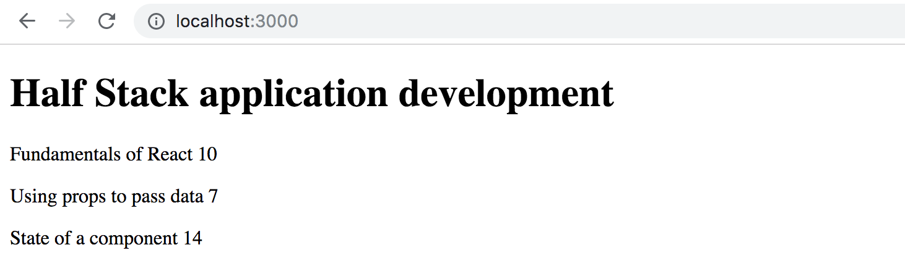
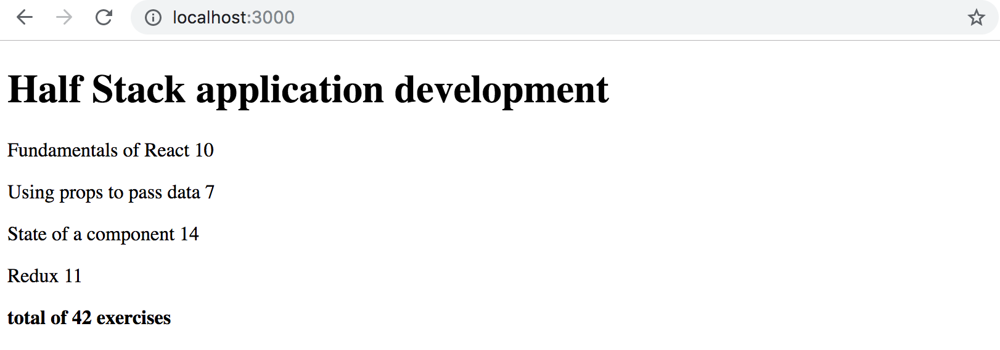
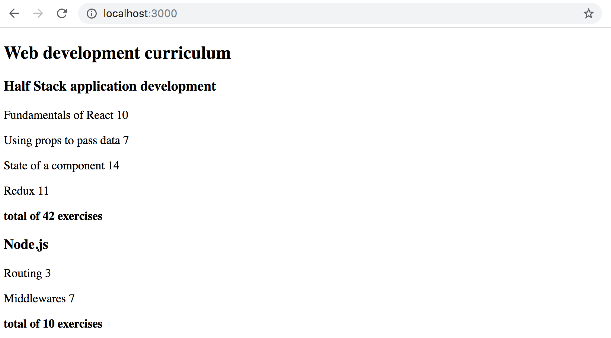

<h4>2.1: Course information step 6</h4>

Let's finish the code for rendering course contents from exercises 1.1 - 1.5. You can start with the code from the model answers. The model answers for part 1 can be found by going to the [submission system](https://studies.cs.helsinki.fi/stats/courses/fullstackopen), clicking on <i>my submissions</i> at the top, and in the row corresponding to part 1 under the <i>solutions</i> column clicking on <i>show</i>. To see the solution to the <i>course info</i> exercise, click on _index.js_ under <i>kurssitiedot</i> ("kurssitiedot" means "course info").

**Note that if you copy a project from one place to another, you might have to delete the <i>node\_modules</i> directory and install the dependencies again with the command _npm install_ before you can start the application.**

Generally, it's not recommended that you copy a project's whole contents and/or add the <i>node\_modules</i> directory to the version control system.

Let's change the <i>App</i> component like so:

```js
const App = () => {
  const course = {
    id: 1,
    name: 'Half Stack application development',
    parts: [
      {
        name: 'Fundamentals of React',
        exercises: 10,
        id: 1
      },
      {
        name: 'Using props to pass data',
        exercises: 7,
        id: 2
      },
      {
        name: 'State of a component',
        exercises: 14,
        id: 3
      }
    ]
  }

  return <Course course={course} />
}

export default App
```

Define a component responsible for formatting a single course called <i>Course</i>.

The component structure of the application can be, for example, the following:

<pre>
App
  Course
    Header
    Content
      Part
      Part
      ...
</pre>

Hence, the <i>Course</i> component contains the components defined in the previous part, which are responsible for rendering the course name and its parts.

The rendered page can, for example, look as follows:



You don't need the sum of the exercises yet.

The application must work <i>regardless of the number of parts a course has</i>, so make sure the application works if you add or remove parts of a course.

Ensure that the console shows no errors!

<h4>2.2: Course information step 7</h4>

Show also the sum of the exercises of the course.



<h4>2.3*: Course information step 8</h4>

If you haven't done so already, calculate the sum of exercises with the array method [reduce](https://developer.mozilla.org/en-US/docs/Web/JavaScript/Reference/Global_Objects/Array/Reduce).

**Pro tip:** when your code looks as follows:

```js
const total = 
  parts.reduce((s, p) => someMagicHere)
```
  
and does not work, it's worth it to use <i>console.log</i>, which requires the arrow function to be written in its longer form:

```js
const total = parts.reduce((s, p) => {
  console.log('what is happening', s, p)
  return someMagicHere 
})
```

**Not working? :** Use your search engine to look up how _reduce_ is used in an **Object Array**.

<h4>2.4: Course information step 9</h4>

Let's extend our application to allow for an <i>arbitrary number</i> of courses:

```js
const App = () => {
  const courses = [
    {
      name: 'Half Stack application development',
      id: 1,
      parts: [
        {
          name: 'Fundamentals of React',
          exercises: 10,
          id: 1
        },
        {
          name: 'Using props to pass data',
          exercises: 7,
          id: 2
        },
        {
          name: 'State of a component',
          exercises: 14,
          id: 3
        },
        {
          name: 'Redux',
          exercises: 11,
          id: 4
        }
      ]
    }, 
    {
      name: 'Node.js',
      id: 2,
      parts: [
        {
          name: 'Routing',
          exercises: 3,
          id: 1
        },
        {
          name: 'Middlewares',
          exercises: 7,
          id: 2
        }
      ]
    }
  ]

  return (
    <div>
      // ...
    </div>
  )
}
```

The application can, for example, look like this:



<h4>2.5: Separate module step 10</h4>

Declare the <i>Course</i> component as a separate module, which is imported by the <i>App</i> component. You can include all subcomponents of the course in the same module.

</div>
