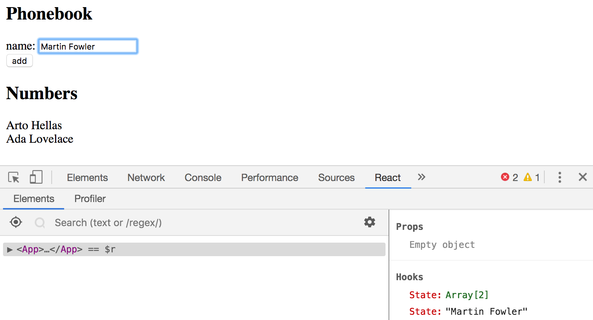
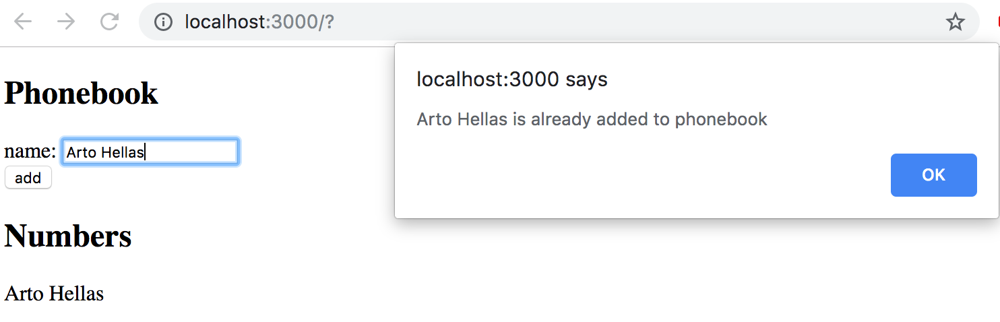
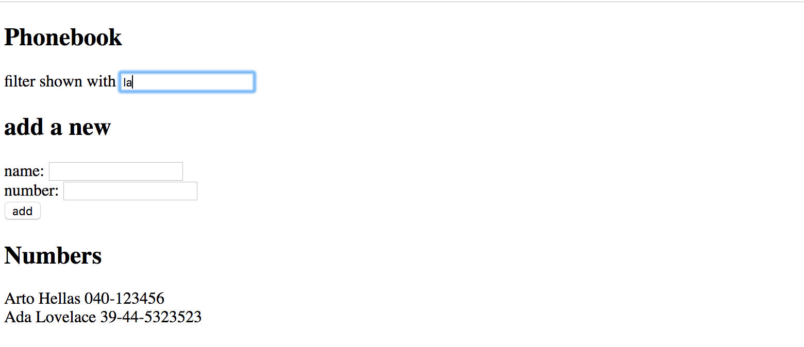
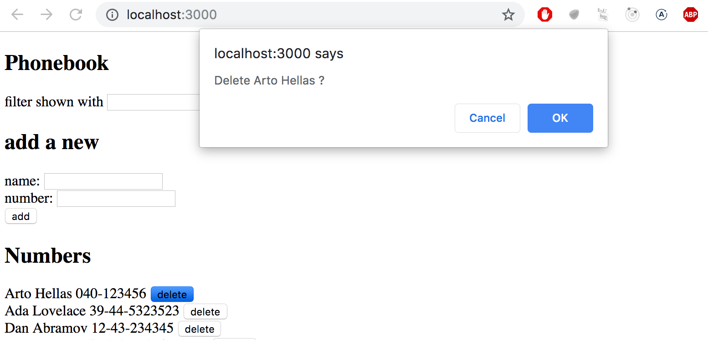
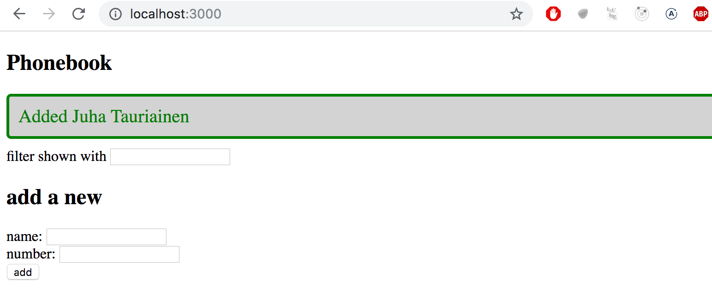
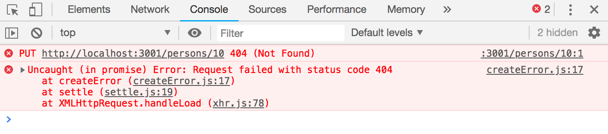
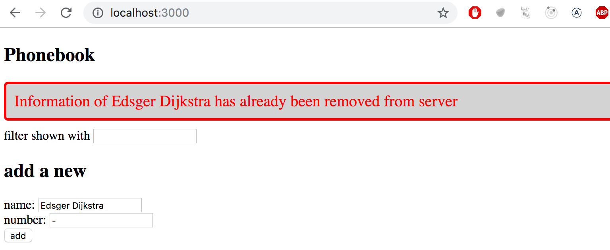

<div class="tasks">

<h4>2.6: The Phonebook Step 1</h4>

Let's create a simple phonebook. <i>**In this part, we will only be adding names to the phonebook.**</i>

Let us start by implementing the addition of a person to the phonebook.

You can use the code below as a starting point for the <i>App</i> component of your application:

```js
import { useState } from 'react'

const App = () => {
  const [persons, setPersons] = useState([
    { name: 'Arto Hellas' }
  ]) 
  const [newName, setNewName] = useState('')

  return (
    <div>
      <h2>Phonebook</h2>
      <form>
        <div>
          name: <input />
        </div>
        <div>
          <button type="submit">add</button>
        </div>
      </form>
      <h2>Numbers</h2>
      ...
    </div>
  )
}

export default App
```

The <em>newName</em> state is meant for controlling the form input element.

Sometimes it can be useful to render state and other variables as text for debugging purposes. You can temporarily add the following element to the rendered component:

```html
<div>debug: {newName}</div>
```

It's also important to put what we learned in the [debugging React applications](/en/part1/a_more_complex_state_debugging_react_apps) chapter of part one into good use. The [React developer tools](https://chrome.google.com/webstore/detail/react-developer-tools/fmkadmapgofadopljbjfkapdkoienihi) extension is <i>incredibly</i> useful for tracking changes that occur in the application's state.

After finishing this exercise your application should look something like this:



Note the use of the React developer tools extension in the picture above!

**NB:**

- you can use the person's name as a value of the <i>key</i> property
- remember to prevent the default action of submitting HTML forms!

<h4>2.7: The Phonebook Step 2</h4>

Prevent the user from being able to add names that already exist in the phonebook. JavaScript arrays have numerous suitable [methods](https://developer.mozilla.org/en-US/docs/Web/JavaScript/Reference/Global_Objects/Array) for accomplishing this task. Keep in mind [how object equality works](https://www.joshbritz.co/blog/why-its-so-hard-to-check-object-equality/) in Javascript.

Issue a warning with the [alert](https://developer.mozilla.org/en-US/docs/Web/API/Window/alert) command when such an action is attempted:



**Hint:** when you are forming strings that contain values from variables, it is recommended to use a [template string](https://developer.mozilla.org/en-US/docs/Web/JavaScript/Reference/Template_literals):

```js
`${newName} is already added to phonebook`
```

If the <em>newName</em> variable holds the value <i>Arto Hellas</i>, the template string expression returns the string

```js
`Arto Hellas is already added to phonebook`
```

The same could be done in a more Java-like fashion by using the plus operator:

```js
newName + ' is already added to phonebook'
```

Using template strings is the more idiomatic option and the sign of a true JavaScript professional.

<h4>2.8: The Phonebook Step 3</h4>

Expand your application by allowing users to add phone numbers to the phone book. You will need to add a second <i>input</i> element to the form (along with its own event handler):

```js
<form>
  <div>name: <input /></div>
  <div>number: <input /></div>
  <div><button type="submit">add</button></div>
</form>
```

At this point, the application could look something like this. The image also displays the application's state with the help of [React developer tools](https://chrome.google.com/webstore/detail/react-developer-tools/fmkadmapgofadopljbjfkapdkoienihi):


<h4>2.9*: The Phonebook Step 4</h4>

Implement a search field that can be used to filter the list of people by name:



You can implement the search field as an <i>input</i> element that is placed outside the HTML form. The filtering logic shown in the image is <i>case insensitive</i>, meaning that the search term <i>arto</i> also returns results that contain Arto with an uppercase A.

**NB:** When you are working on new functionality, it's often useful to "hardcode" some dummy data into your application, e.g.

```js
const App = () => {
  const [persons, setPersons] = useState([
    { name: 'Arto Hellas', number: '040-123456', id: 1 },
    { name: 'Ada Lovelace', number: '39-44-5323523', id: 2 },
    { name: 'Dan Abramov', number: '12-43-234345', id: 3 },
    { name: 'Mary Poppendieck', number: '39-23-6423122', id: 4 }
  ])

  // ...
}
```

This saves you from having to manually input data into your application for testing out your new functionality.

<h4>2.10: The Phonebook Step 5</h4>

If you have implemented your application in a single component, refactor it by extracting suitable parts into new components. Maintain the application's state and all event handlers in the <i>App</i> root component.

It is sufficient to extract <i>**three**</i> components from the application. Good candidates for separate components are, for example, the search filter, the form for adding new people to the phonebook, a component that renders all people from the phonebook, and a component that renders a single person's details.

The application's root component could look similar to this after the refactoring. The refactored root component below only renders titles and lets the extracted components take care of the rest.

```js
const App = () => {
  // ...

  return (
    <div>
      <h2>Phonebook</h2>

      <Filter ... />

      <h3>Add a new</h3>

      <PersonForm 
        ...
      />

      <h3>Numbers</h3>

      <Persons ... />
    </div>
  )
}
```

**NB**: You might run into problems in this exercise if you define your components "in the wrong place". Now would be a good time to rehearse the chapter [do not define a component in another component](/en/part1/a_more_complex_state_debugging_react_apps#do-not-define-components-within-components) from the last part.

<h4>2.11: The Phonebook Step 6</h4>

We continue with developing the phonebook. Store the initial state of the application in the file <i>db.json</i>, which should be placed in the root of the project.

```json
{
  "persons":[
    { 
      "name": "Arto Hellas", 
      "number": "040-123456",
      "id": "1"
    },
    { 
      "name": "Ada Lovelace", 
      "number": "39-44-5323523",
      "id": "2"
    },
    { 
      "name": "Dan Abramov", 
      "number": "12-43-234345",
      "id": "3"
    },
    { 
      "name": "Mary Poppendieck", 
      "number": "39-23-6423122",
      "id": "4"
    }
  ]
}
```

Start json-server on port 3001 and make sure that the server returns the list of people by going to the address <http://localhost:3001/persons> in the browser.

If you receive the following error message:

```js
events.js:182
      throw er; // Unhandled 'error' event
      ^

Error: listen EADDRINUSE 0.0.0.0:3001
    at Object._errnoException (util.js:1019:11)
    at _exceptionWithHostPort (util.js:1041:20)
```

it means that port 3001 is already in use by another application, e.g. in use by an already running json-server. Close the other application, or change the port in case that doesn't work.

Modify the application such that the initial state of the data is fetched from the server using the <i>axios</i>-library. Complete the fetching with an [Effect hook](https://react.dev/reference/react/useEffect).


<h4>2.12: The Phonebook step 7</h4>

Let's return to our phonebook application.

Currently, the numbers that are added to the phonebook are not saved to a backend server. Fix this situation.

<h4>2.13: The Phonebook step 8</h4>

Extract the code that handles the communication with the backend into its own module by following the example shown earlier in this part of the course material.

<h4>2.14: The Phonebook step 9</h4>

Make it possible for users to delete entries from the phonebook. The deletion can be done through a dedicated button for each person in the phonebook list. You can confirm the action from the user by using the [window.confirm](https://developer.mozilla.org/en-US/docs/Web/API/Window/confirm) method:



The associated resource for a person in the backend can be deleted by making an HTTP DELETE request to the resource's URL. If we are deleting e.g. a person who has the <i>id</i> 2, we would have to make an HTTP DELETE request to the URL <i>localhost:3001/persons/2</i>. No data is sent with the request.

You can make an HTTP DELETE request with the [axios](https://github.com/axios/axios) library in the same way that we make all of the other requests.

**NB:** You can't use the name <em>delete</em> for a variable because it's a reserved word in JavaScript. E.g. the following is not possible:

```js
// use some other name for variable!
const delete = (id) => {
  // ...
}
```

<h4>2.15*: The Phonebook step 10</h4>

<i>Why is there a star in the exercise? See [here](/en/part0/general_info#taking-the-course) for the explanation.</i>

Change the functionality so that if a number is added to an already existing user, the new number will replace the old number. It's recommended to use the HTTP PUT method for updating the phone number.

If the person's information is already in the phonebook, the application can ask the user to confirm the action:


<h4>2.16: Phonebook step 11</h4>

Use the [improved error message](/en/part2/adding_styles_to_react_app#improved-error-message) example from part 2 as a guide to show a notification that lasts for a few seconds after a successful operation is executed (a person is added or a number is changed):



<h4>2.17*: Phonebook step 12</h4>

Open your application in two browsers. **If you delete a person in browser 1** a short while before attempting to <i>change the person's phone number</i> in browser 2, you will get the following error messages:



Fix the issue according to the example shown in [promise and errors](/en/part2/altering_data_in_server#promises-and-errors) in part 2. Modify the example so that the user is shown a message when the operation does not succeed. The messages shown for successful and unsuccessful events should look different:



**Note** that even if you handle the exception, the first "404" error message is still printed to the console. But you should not see "Uncaught (in promise) Error".

</div>
